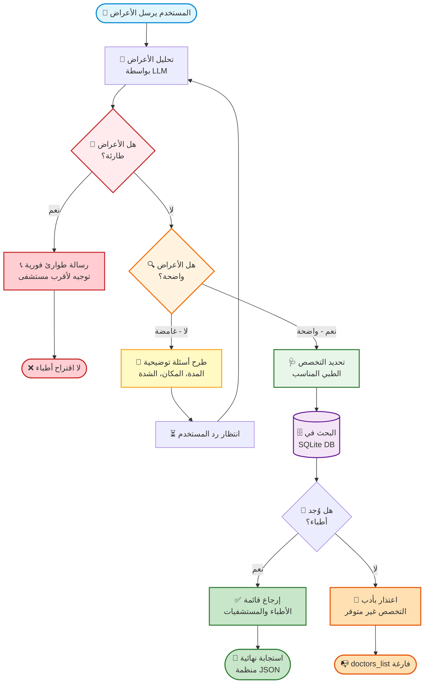
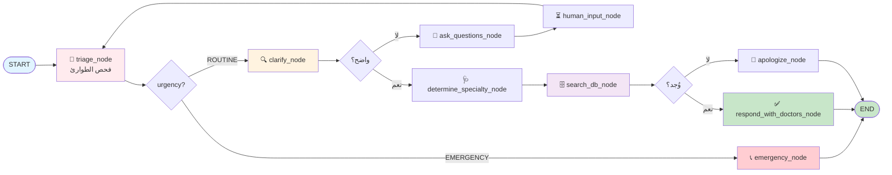

# 🏥 HealTrip AI — مساعد الفرز الطبي الذكي

<div align="center">


**مساعد ذكاء اصطناعي ثنائي اللغة (عربي/إنجليزي) يحلّل الأعراض، يحدد الطوارئ، ويقترح الأطباء والمستشفيات**

</div>

---

## 📋 جدول المحتويات

- [نظرة عامة](#-نظرة-عامة)
- [المميزات](#-المميزات)
- [كيف يعمل النظام](#-كيف-يعمل-النظام)
- [مخطط سير العمل](#-مخطط-سير-العمل-workflow-diagram)
- [البنية المعمارية المستقبلية (LangGraph)](#-البنية-المعمارية-المستقبلية-langgraph)
- [سيناريوهات المحادثة](#-سيناريوهات-المحادثة)
- [المتطلبات](#-المتطلبات)
- [التثبيت](#-التثبيت)
- [الإعداد](#-الإعداد)
- [قاعدة البيانات](#-قاعدة-البيانات)
- [الاستخدام](#-الاستخدام)
- [هيكل المشروع](#-هيكل-المشروع)
- [بروتوكولات الأمان](#-بروتوكولات-الأمان)
- [التقنيات المستخدمة](#-التقنيات-المستخدمة)
- [خارطة التطوير](#-خارطة-التطوير)

---

## 🎯 نظرة عامة

**HealTrip AI** هو وكيل ذكاء اصطناعي (AI Agent) متخصص في **الفرز الطبي التفاعلي**. المستخدم يصف الأعراض التي يشعر بها، والنظام يتخذ سلسلة قرارات ذكية:

1. 🔍 هل الأعراض **واضحة بما يكفي** لتحديد التخصص؟
2. 🚨 هل الأعراض **تستدعي الطوارئ**؟
3. 💬 إذا كانت الأعراض **غامضة أو عامة**، يسأل أسئلة توضيحية قبل اتخاذ أي قرار.
4. 🩺 عند وضوح الأعراض، يبحث في قاعدة البيانات عن الطبيب أو المستشفى المناسب.
5. ❌ إذا لم يجد التخصص، يعتذر بأدب ويخبر المستخدم أن التخصص غير متوفر.

النظام مبني على **محادثة متعددة الأدوار (Multi-turn Conversation)** وليس مجرد سؤال → جواب.

> 📌 **ملاحظة**: هذه النسخة هي **Demo / Proof of Concept**، تم بناؤها باستخدام LangChain. النسخة الإنتاجية الكاملة ستُبنى على **LangGraph** لإدارة أفضل لتدفّق الحالات (State Machine) والعقد (Nodes).

---

## ✨ المميزات

- 🩺 **فرز طبي ذكي متعدد الأدوار**: يحاور المستخدم لتوضيح الأعراض
- 🚨 **كشف تلقائي للطوارئ**: بدون اقتراح أي مستشفى عند الخطر
- 🌍 **ثنائي اللغة بالكامل**: يرد بلغة المستخدم تلقائيًا
- 🛠️ **Tool Calling**: يستدعي `search_doctors_tool` للبحث في SQLite
- 📊 **مخرجات منظمة**: JSON ثابت عبر Pydantic
- 🧠 **أسئلة توضيحية ذكية**: متابعة تلقائية عند الأعراض العامة
- 🚫 **حماية كاملة من الهلوسة**: عند عدم وجود نتائج → اعتذار واضح
- 🔐 **حماية الخصوصية**: لا يسأل عن الموقع الجغرافي أو الرسوم الطبية
- 🔄 **Context Injection**: حقن نتائج القاعدة في الـ Prompt لمنع الاختلاق

---

## 🔄 كيف يعمل النظام

يدخل المستخدم بوصف الأعراض، ثم يمر الطلب عبر سلسلة من الفحوصات المنطقية:

1. **فحص الطوارئ** 🚨 — إذا كانت الأعراض خطرة، رسالة إسعاف فورية.
2. **فحص الوضوح** 🔍 — إذا كانت غامضة، أسئلة توضيحية.
3. **تحديد التخصص** 🩺 — إذا كانت واضحة، تحديد التخصص المناسب.
4. **البحث في DB** 🗄️ — استدعاء أداة البحث.
5. **الاستجابة النهائية** ✅ — أطباء متاحون أو اعتذار.

---

## 📊 مخطط سير العمل (Workflow Diagram)



---

## 🏗️ البنية المعمارية المستقبلية (LangGraph)

هذه النسخة الحالية (Demo) مبنية على **LangChain** فقط، حيث تُدار سلسلة القرارات عبر شروط برمجية (if/else) داخل دالة `run_healtrip_agent`.

في **النسخة الإنتاجية الكاملة**، سيتم استخدام **LangGraph** لتحويل هذا التدفّق إلى **رسم بياني للحالات (State Graph)** يوفّر:

- ✅ **إدارة واضحة للعقد (Nodes)**: كل خطوة تصبح عقدة مستقلة (`triage_node`, `clarify_node`, `search_node`, `respond_node`)
- ✅ **انتقالات شرطية (Conditional Edges)**: تحكّم دقيق بمسار المحادثة بناءً على الحالة
- ✅ **ذاكرة محادثة دائمة (Persistent State)**: حفظ حالة المستخدم عبر عدة جلسات
- ✅ **Human-in-the-Loop**: إمكانية تدخل بشري عند الحاجة (مثلًا: تأكيد طوارئ)
- ✅ **إعادة المحاولة التلقائية (Retry)**: عند فشل استدعاء أداة أو LLM
- ✅ **قابلية المراقبة (Observability)**: تتبع كامل لكل خطوة عبر LangSmith

### 📊 البنية المقترحة بـ LangGraph



### 🆚 مقارنة: LangChain vs LangGraph

| المعيار | LangChain (Demo) | LangGraph (Production) |
|---------|-------------------|------------------------|
| إدارة التدفّق | شروط داخل دالة | رسم بياني صريح |
| إضافة خطوة جديدة | تعديل الكود | إضافة Node |
| الذاكرة | يدوية (`chat_history`) | مُدمجة (Checkpointer) |
| إعادة المحاولة | يدوية | مُدمجة (Retry Policy) |
| التدخل البشري | صعب | `interrupt_before` |
| قابلية المراقبة | محدودة | LangSmith مدمج |

---

## 💬 سيناريوهات المحادثة

### 🚨 سيناريو 1: طوارئ

```
👤 المستخدم: عندي ألم شديد في صدري وضيق في النفس وتنميل في ذراعي اليسرى

🤖 HealTrip AI:
   urgency_level: "EMERGENCY"
   response_text: "⚠️ هذه أعراض قد تشير إلى نوبة قلبية!
                   اتجه فورًا إلى أقرب قسم طوارئ."
   doctors_list: []
```

### 💬 سيناريو 2: أعراض غامضة

```
👤 المستخدم: عندي ألم في جسمي

🤖 HealTrip AI:
   clarifying_questions:
     - "أين تشعر بالألم بالتحديد؟"
     - "منذ متى بدأ الألم؟"
     - "هل يوجد تورم أو احمرار؟"
```

### ✅ سيناريو 3: أعراض واضحة

```
👤 المستخدم: عندي ألم في الركبة منذ 3 أيام بعد الرياضة

🤖 HealTrip AI:
   recommended_specialty: "Orthopedics"
   doctors_list: [ {اسم، مستشفى، مدينة} ]
```

### ❌ سيناريو 4: تخصص غير موجود

```
👤 المستخدم: عندي ألم في أسناني

🤖 HealTrip AI:
   response_text: "أعتذر، تخصص طب الأسنان غير متوفر حاليًا."
   doctors_list: []
```

---

## 🛠️ المتطلبات

- Python 3.10+
- مفتاح Google AI Studio (Gemini)
- SQLite 3
- RAM ≥ 4GB

---

## 📦 التثبيت

```bash
git clone https://github.com/USERNAME/healtrip-ai.git
cd healtrip-ai
python -m venv venv
source venv/bin/activate
pip install -r requirements.txt
```

**requirements.txt:**

```txt
langchain-core>=0.3.0
langchain-google-genai>=2.0.0
pydantic>=2.0.0
python-dotenv>=1.0.0
```

---

## ⚙️ الإعداد

### `.env`

```env
GOOGLE_API_KEY=your_gemini_api_key_here
```

### `config.py`

```python
import os
from dotenv import load_dotenv

load_dotenv()

GOOGLE_API_KEY = os.getenv("GOOGLE_API_KEY")
```

---

## 🗄️ قاعدة البيانات

```sql
CREATE TABLE doctors (
    id            INTEGER PRIMARY KEY AUTOINCREMENT,
    name_ar       TEXT NOT NULL,
    name_en       TEXT NOT NULL,
    hospital_ar   TEXT NOT NULL,
    hospital_en   TEXT NOT NULL,
    specialty_ar  TEXT NOT NULL,
    specialty_en  TEXT NOT NULL,
    city_ar       TEXT,
    city_en       TEXT
);
```

---

## 🚀 الاستخدام

```python
from agent import run_healtrip_agent

response = run_healtrip_agent(
    user_input="عندي ألم في الركبة منذ 3 أيام"
)

print(response["urgency_level"])         # ROUTINE
print(response["recommended_specialty"]) # Orthopedics
print(response["doctors_list"])
```

---
## 📁 هيكل المشروع

> 📌 **ملاحظة**: النسخة الحالية (Demo) مبنية بـ **Python + LangChain** لأغراض العرض السريع.
> البنية الإنتاجية الكاملة ستُبنى بـ **Node.js + TypeScript** مع تطبيق  Architecture.

```text
demo_node_app_strcuture/
├── package.json
├── src/
│   ├── app.ts
│   ├── config/
│   │   └── db.ts
│   ├── controllers/
│   │   └── auth/
│   │       └── RegisterController.ts
│   ├── middlewares/
│   │   ├── error.middleware.ts
│   │   └── validation.middleware.ts
│   ├── models/
│   │   └── schema.ts
│   ├── repositories/
│   │   └── UserRepository.ts
│   ├── routes/
│   │   └── authRoutes.ts
│   ├── server.ts
│   ├── services/
│   │   └── auth/
│   │       └── RegisterService.ts
│   ├── utils/
│   │   ├── AppError.ts
│   │   └── catchAsync.ts
│   └── validations/
│       └── auth.validation.ts
└── tsconfig.json
```

---

## 🛡️ بروتوكولات الأمان

### 1. الطوارئ لها الأولوية المطلقة

```python
if output.urgency_level == "EMERGENCY":
    output.doctors_list = []
```

### 2. لا هلوسة عند غياب البيانات

- ✅ `doctors_list = []`
- ✅ رسالة اعتذار واضحة
- ❌ ممنوع اختلاق أسماء أطباء أو مستشفيات

### 3. حماية خصوصية المستخدم

- ❌ لا سؤال عن المدينة
- ❌ لا سؤال عن الرسوم
- ✅ التركيز على الأعراض فقط

### 4. مطابقة اللغة تلقائيًا

يرد النظام بنفس لغة المستخدم تلقائيًا (عربي/إنجليزي).

---

## 🧰 التقنيات المستخدمة

| المكوّن | التقنية |
|---------|---------|
| اللغة | Python 3.10+ |
| إطار العمل الحالي | LangChain Core |
| إطار العمل المستقبلي | **LangGraph** (للإنتاج) |
| النموذج اللغوي | Google Gemini |
| Structured Output | Pydantic v2 |
| قاعدة البيانات | SQLite 3 |
| Tool Calling | `@tool` Decorator |
| إدارة الأسرار | python-dotenv |

---

## 🗺️ خارطة التطوير

- [x] فرز طبي أساسي
- [x] Tool Calling على SQLite
- [x] Structured Output مع Pydantic
- [x] حماية من الهلوسة
- [x] أسئلة توضيحية تلقائية
- [ ] **الانتقال إلى LangGraph** لإدارة العقد والحالات
- [ ] ذاكرة محادثة دائمة (Persistent Memory via Checkpointer)
- [ ] RAG على تقارير طبية PDF
- [ ] Human-in-the-Loop للطوارئ الحرجة
- [ ] واجهة FastAPI
- [ ] واجهة Streamlit / React
- [ ] نظام تسجيل وتقييم (LangSmith)
- [ ] دعم نماذج بديلة (OpenAI / Anthropic / Ollama)

---

## ⚠️ إخلاء مسؤولية

> هذا النظام **أداة مساعدة للفرز الأولي فقط**، ولا يُعد بديلًا عن استشارة طبيب مختص.
> في الحالات الطارئة، اتصل بالإسعاف فورًا.

---

<div align="center">

**صُنع بـ ❤️ لخدمة الرعاية الصحية**

⭐ Demo Project — Production version powered by **LangGraph**

</div>
